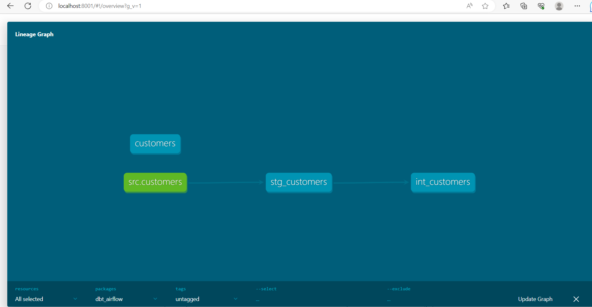

# DBT LABS
## _dbt-test-airflow_

[](https://www.n-able.biz/)


[]()

Welcome to the Project dbt-pkdd99-finance-dw! This project utilizes dbt (data build tool) to transform and model data. It provides a structured approach to building data pipelines and enables data analysts and engineers to collaborate effectively.

## Getting Started

To get started with this project, follow the steps below:

## Prerequisites

- dbt (data build tool) installed on your local machine. You can install dbt by following the instructions at [dbt Installation Guide](https://docs.getdbt.com/dbt-cli/installation)

## Installation
### psql server setup - steps
### Prerequisites
Before you begin, ensure that you have the following prerequisites installed:
- Docker: You can download and install Docker from the official website (https://www.docker.com).

**steps**- 
#### Intall Docker #### 
##### 1. Download and install Docker by following the official instructions for your operating system. #####

##### 2. Once the installation is complete, verify that Docker is running by opening a terminal (or command prompt) and running the following command: ##### 
```sh
docker --version
```
You should see the Docker version information printed in the terminal.

#### Start PostgreSQL Container #### 
##### 1. Open a terminal (or command prompt).
##### 2. Run the following command to start a PostgreSQL container:
```sh
docker run --name postgres-container -e POSTGRES_PASSWORD=your_password -p 5432:5432 -d postgres
```
Replace **your_password** with a strong password of your choice.
##### 3. Wait for the container to start. You can check its status by running the command:
```sh
docker ps
```
you should see the postgres-container listed with a status of "Up" or "Running."

#### Install and Start pgAdmin
##### 1. Open a web browser and go to http://localhost:5050.
##### 2. Click on the "Click here" link to download the pgAdmin Docker image.
##### 3. Once the download is complete, go to your terminal (or command prompt) and run the following command to start the pgAdmin container:
   ```sh
   docker run --name pgadmin-container -p 5050:80 -e PGADMIN_DEFAULT_EMAIL=your_email -e PGADMIN_DEFAULT_PASSWORD=your_password -d dpage/pgadmin4
   ```
   Replace your_email and your_password with your desired email address and password for the pgAdmin login.
##### 4. Wait for the container to start. You can check its status by running the command:
```sh
docker ps
```
you should see the pgAdmin-container listed with a status of "Up" or "Running."
   
#### Configure pgAdmin
1. Go back to your web browser and access http://localhost:5050.
2. Log in to pgAdmin using the email and password you set in the previous step.
3. In the pgAdmin interface, click on "Add New Server" under the "Quick Links" section.
4. Enter the following details:
- **Name**: Give a name for your server (e.g., My PostgreSQL Server).
- **Host name/address**: postgres-container
- **Port**: 5432
- **Username**: postgres
- **Password**: The password you set for the PostgreSQL container.
6. Click "Save" to add the server.
7. You should now see the server listed in the left sidebar. Click on it to access and manage your PostgreSQL database using pgAdmin.

### Clone the repository to your local machine:
   ```sh
   git clone https://github.com/koshitha-nable/dbt-airflow-test.git
   ```
### Navigate to the project directory:
   ```sh
  cd dbt-airflow-test
   ```
### Install the project dependencies:
```sh
pip install -r requirements.txt
```
### Running the container

1. start required docker services with docker-compose-initiate database
    ```sh
     cd docker_airflow
     docker compose up airflow-init
    ```
2. check all docker application services up and running 
    Running Airflow:
    ```sh
    docker compose up
    ```
3. Start the Airflow scheduler and web server:
    ```sh
    airflow scheduler
    airflow webserver -p 8080
    ```

### Configuration
1. Open the dbt_project.yml file and update the necessary configurations, such as **target database**, **credentials**, and other project-specific settings.
2. Configure your database connection by creating a **profiles.yml** file in the ~/.dbt directory. Refer to the [dbt Profiles Documentation](https://docs.getdbt.com/reference/warehouse-profiles) for more details.

### Dataset Details
    Please make sure to have customer csv file available in your project seed file before running the dbt commands.


### Running the project

#### Building Data Models ####
**To build the data models and transform your data, follow these steps:**

##### 1. Test the database connection and show information for debugging purposes ####
```sh
cd dbt_airflow
dbt debug
```
##### 2. Downloads dependencies for a project
```sh
dbt deps
```
##### 3. Loads CSV files into the database #####
```sh
dbt seed
```
This command will load csv files located in the seed-paths directory of your dbt project into your data warehouse.
##### 4. To execute the compiled SQL transformations and materialize the models, use the following command: #####
```sh
dbt run
```
Running this command will create or update the tables/views defined in your project. It applies the transformations defined in the models and loads the data into the target database.

##### If you want to perform a full refresh of the data models, including dropping and recreating the tables/views, use the following command: #####

```sh
dbt run --full-refresh
```
This command ensures that the data models reflect the latest state of the source data.

#### Testing ####
**To test the project models and ensure the accuracy of the transformations, follow these step:**
##### To execute the tests defined in your project, use the following command: ##### 
```sh
dbt test
```

This command runs the tests specified in this project, checking if the expected results match the actual data.

#### Documentation #### 
**To generate and view the documentation for this dbt project, follow these steps:**
##### 1. Generate the documentation by running the following command: #####
```sh
dbt docs generate
```
This command generates HTML pages documenting the models, tests, and macros in your project.
#####  2. Serve the documentation locally by running the following command: ##### 
```sh
dbt docs serve
```
This command starts a local web server to host the documentation. You can access it by opening your browser and visiting the provided URL.
**Note**: Remember to generate the documentation before serving it.

###### Generated lineage graph



 Refer the [dbt commands](https://docs.getdbt.com/reference/dbt-commands) for more details.

#### Airflow Web UI
The Airflow Web UI provides a graphical interface for managing and monitoring workflows. Through the UI, you can:

- View and manage DAGs, including enabling/disabling DAGs and individual tasks.
- Trigger manual executions of tasks or entire DAGs.
- Monitor task status, logs, and execution history.
- Configure connections to external systems and variables for use within your DAGs.
- Define schedules and set up task dependencies.
- The Airflow Web UI offers a user-friendly way to interact with Airflow and gain insights into your workflows.

To access the Airflow Web UI, you need to follow these steps:

1. Install and Configure Airflow: Ensure that you have installed and configured Airflow on your machine or server. Refer to the official [Airflow documentation](https://airflow.apache.org/docs/apache-airflow/stable/howto/docker-compose/index.html) for detailed instructions on installation and configuration.

2. Start the Airflow Web Server: Open a terminal or command prompt and navigate to the Airflow installation directory. Use the following command to start the Airflow web server:
    ```sh
    airflow webserver
    ```
- By default, the web server will listen on port 8080. If you want to use a different port, you can specify it using the -p or --port option followed by the desired port number.
3. Access the Airflow Web UI: Open a web browser and enter the following URL:
    ```sh
    http://localhost:8080
    ```
- If you started the web server on a different port, replace 8080 with the corresponding port number.

4. Login to the Airflow Web UI: You will be directed to the Airflow login page. Enter your username and password to log in. The default username and password are typically set to admin. Make sure to change the default credentials for security reasons.

5. Explore the Airflow Web UI: Once logged in, you will be presented with the Airflow Web UI. Here, you can perform various actions such as:

    - View and manage DAGs: The UI provides an overview of all your DAGs, their status, and configuration details. You can enable or disable DAGs, trigger manual runs, and view the DAG structure.

    - Monitor task execution: Check the status of individual tasks, view task logs, and track the execution history. You can identify successful runs, failed runs, and ongoing runs.

    - Configure connections and variables: Airflow allows you to define connections to external systems (e.g., databases, APIs) and variables (e.g., reusable configuration values). You can manage these configurations through the web UI.

    - Access additional features: The Airflow Web UI offers other functionalities, such as browsing logs, configuring access controls, and managing plugins. Explore the UI to leverage these features.

    Remember to secure access to the Airflow Web UI by configuring authentication and authorization mechanisms according to your requirements.

    By following these steps, you should be able to access and utilize the Airflow Web UI for managing and monitoring your workflows.